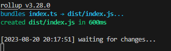
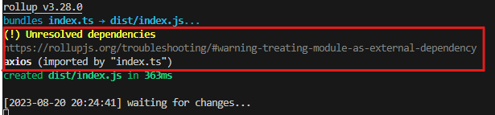
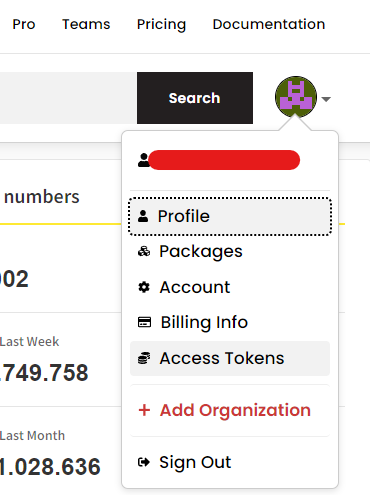

# Build and publish your own NPM package
This guide will go through setting up a Typescript project to be published as an NPM package to [npmjs.com](https://npmjs.com).


# Setting up the project #
1. To setup the NPM project run:
   ```bash
   npm init
   ```
   And answer the questions asked. It is not important to set everything correctly right now, as we can always change it later.

2. Install Typescript (at the time of writing version 5.1.6) and [Rollup](https://rollupjs.org) (3.27.0)
   ```bash
   npm i -D typescript rollup rollup-plugin-typescript2
   ```
   `rollup` is used to create and optimize the bundle we will publish and `rollup-plugin-typescript2` is used to instruct rollup how to handle typescript files.

3. Initialize typescript project
    ```bash
    npx tsc --init
    ```
    This will generate the `tsconfig.json` file.

4. Make sure that these settings are set in the `tsconfig.json`
    ```json
    {
        "module": "ES2022", // rollup cannot handle 'commonjs' - you can use 'ES2015', 'ES2020', 'ES2022' or 'ESNext'
        "moduleResolution": "Node" // otherwise you can't use module imports like "import axios from 'axios'"
        "declaration": true, // to make sure the types (d.ts files) are emitted to dist folder as well
        "declarationMap": true, // to create sourcemaps for d.ts files
        "noEmit": true // rollup will emit the code no need here
    }
    ```

5. Create a `rollup.config.mjs` file with the following contents. See full configuration options [here](https://rollupjs.org/configuration-options/)
    ```javascript
    import typescript from 'rollup-plugin-typescript2'

    export default {
        input: 'index.ts', // this is the entrypoint relative to project root. This option is not affected by tsconfig settings
        output: [
            {
                file: "dist/index.js",
                format: 'cjs',
                exports: 'named',
                sourcemap: true,
                strict: true
            }
        ],
        // add the typescript plugin to let rollup know how to handle typescript files
        plugins: [typescript()],
        // if the application has any peer dependencies which are not bundled in the package, you can specify them here
        external: []
    }

    ```

6. Add the following scripts to the `package.json`. The start script will run a watch which will trigger a build when any file changes any. The build script runs a single build, this would be used in your CI/CD pipeline.
    ```json
    {
        ...
        "scripts": {
            "start": "rollup -c -w",
            "build": "rollup -c"
        }
        ...
    }
    ```
7. Create the `index.ts` file in the root of the project. This is the entrypoint to the package no matter if the package is a CLI tool or a React component library. For now you can just add the following:
    ```typescript
    console.log('hello world')
    ```
8. Last create a `.npmignore` file in the root of the project. And add the following content
    ```text
    rollup.config.mjs
    tsconfig.json
    index.ts
    ```
    This will make sure that redundant files are not included in the bundle published to npmjs.org
8. This is the minimal setup for the project itself keep reading to configure continuous deployment. To start developing run 
    ```bash
    npm start
    ```
    You should get the following output:  
    

# Additional dependencies
Usually you will need a few more dependencies for building your package. Be careful not to add dependencies using the normal `npm install` command as this would mean that these dependencies would be bundled along with your package and increase the size and in worst case cause conflicts for users of the package.

Instead add the packages as development dependencies using
```bash
npm install --save-dev some-package
# or
npm i -D some-package
```
And then add the package to the `peerDependencies` object in your package json like this
```json
{
   "peerDependencies": {
    "axios": "^1.4.0"
  },
  "devDependencies": {
    "axios": "^1.4.0"
  } 
}
```
as well as in the `rollup.config.mjs`
```javascript
export default {
    // ...
    external: ["axios"]
}
```
If you forget, you will also get a warning when rollup is running


# Test the package
To verify that the bundle is working properly you should always test the project first. 
There are several ways to do this, I recommend using both of these methods:

1. [Using test project](#using-test-project)
2. [Using dry-run](#using-dry-run)

## Using test project 
You can create a new project and use the `npm link` command to add your local package as a dependency
```bash
# in dist folder run
npm link
# in test project root run
npm link my-package --save
```
`my-package` is the name specified in the package.json of your package project.
The result should be a new line in your `dependencies` section in your `package.json` which looks something like this:
```json
{
    "my-package": "file:../my-package"
}
```
Now you can use the packages or commands from the package.

## Using dry-run
Run the command
```bash
npm publish --dry-run
```
This will show you all the files that will be published.
This script is very good for finding files you don't want to publish.
Files that are irrelevant to the bundle should be added to a `.npmignore` file, which follows the same rules as the `.gitignore` file.

Read more about the `.npmignore` file [here](https://docs.npmjs.com/cli/v9/using-npm/developers#testing-whether-your-npmignore-or-files-config-works
)

# Configure workflow
1. In [npmjs.org](https://www.npmjs.com/) go to `Access Tokens`  

2. Create a
* `classic` access token of type `Automation` 
* or a `granular`  access token with the `read and write` permission on `Packages and scopes`
3. Copy the token and save it as a repo secret in Github with the name `NPM_TOKEN`.
Create `.github/workflows/publish.yaml` with the following content
```yaml
name: Publish Package to npmjs
on:
  release:
    types: [published]
jobs:
  build:
    runs-on: ubuntu-latest
    steps:
      - uses: actions/checkout@v3
      # Setup .npmrc file to publish to npm
      - uses: actions/setup-node@v3
        with:
          node-version: '16.x'
          registry-url: 'https://registry.npmjs.org'
      # install dependencies
      - run: npm ci
      # build the project
      - run: npm run build
      # publish the package to npmjs.org
      - run: npm publish --access public
        env:
          NODE_AUTH_TOKEN: ${{ secrets.NPM_TOKEN }}

```
After you push the code you can create a new release. (You find the releases in the `code` tab of your repository then navigate to `tags` where you can create releases)
When the release has been created and published, the workflow will start and publish the package to npmjs.org.
Remember to update the `version` in your `package.json` before you create a new release.

# Problems

## If building CLI tools
If you are building a CLI tool and have added `#!/usr/bin/env node` at the top of your `index.ts` and the script still doesn't work. You can try the following:
1. Install `rollup-plugin-preserve-shebangs`
    ```bash
    npm i -D rollup-plugin-preserve-shebangs
    ```
2. Update the `rollup.config.mjs` file:
    ```javascript
    import { preserveShebangs } from 'rollup-plugin-preserve-shebangs';
    export default {
        // ...
        plugins: [
            // ...
            preserveShebangs()
        ],
    }
    ```
3. Now the generated output should include `#!/usr/bin/env node`.

# References
* https://docs.npmjs.com/creating-and-publishing-scoped-public-packages
* https://www.digitalocean.com/community/tutorials/typescript-new-project

